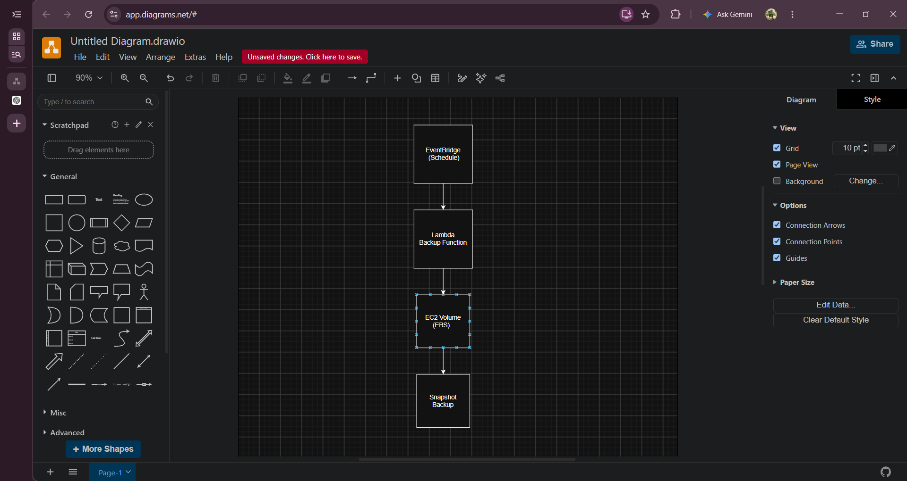
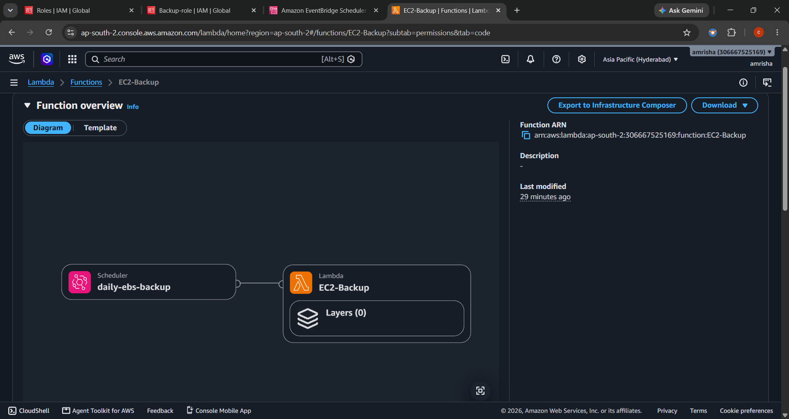
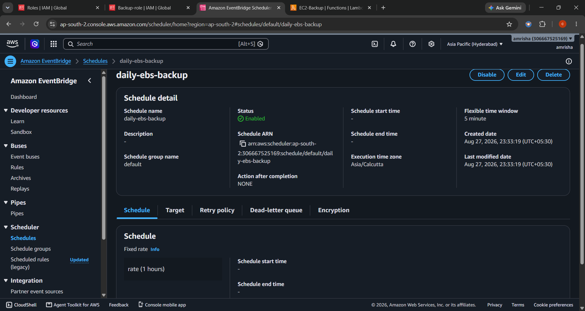
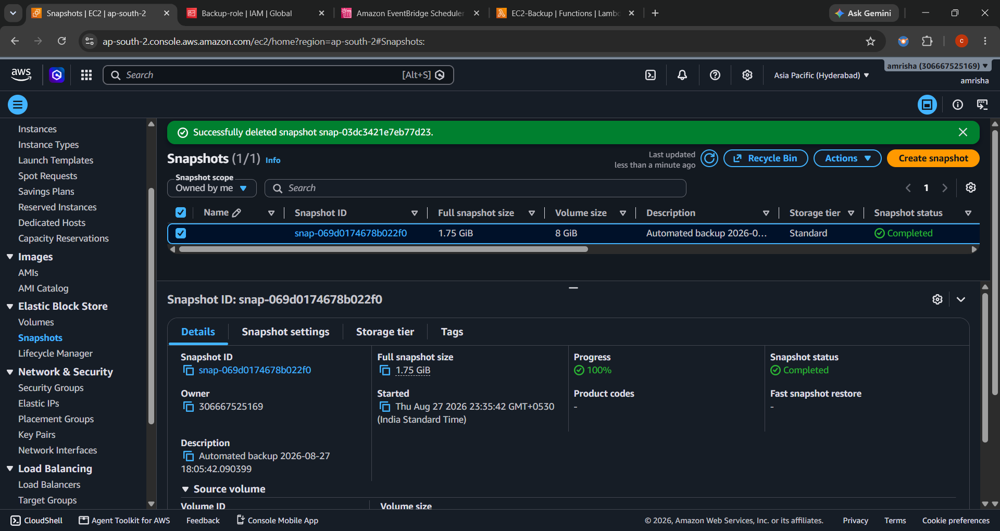

# AWS Automated EC2 Backup Solution

Automating EBS snapshot creation using AWS Lambda and Amazon EventBridge.

This project demonstrates how I automated the backup process of an Amazon EC2 instance by creating EBS snapshots using AWS Lambda. The Lambda function is triggered automatically on a schedule using Amazon EventBridge, eliminating the need for manual backups.

## Architecture



## AWS Services & Tools Used

- Amazon EC2
- Amazon EBS
- AWS Lambda
- Amazon EventBridge
- AWS IAM
- Git
- GitHub

## What I Did

1. Launched an Amazon EC2 instance.
2. Identified the attached EBS volume.
3. Created an IAM role for Lambda.
4. Developed a Lambda function using Python and Boto3.
5. Configured Lambda to create EBS snapshots automatically.
6. Tested snapshot creation manually.
7. Created an EventBridge scheduled rule.
8. Automated daily EBS backups.
9. Verified snapshot creation in AWS.
10. Documented the project with screenshots and an architecture diagram.

## Screenshots

### EC2 Instance


### Lambda Function



### EventBridge Rule



### EBS Snapshot



## What I Learned

- AWS Lambda fundamentals
- Serverless automation
- Amazon EventBridge scheduling
- EBS snapshot management
- IAM roles and permissions
- AWS backup strategies
- Python automation using Boto3
- Event-driven architecture

## Project Structure

```text
aws-automated-ec2-backup/
│
├── lambda-function/
│   └── lambda_function.py
│
├── architecture/
│   └── architecture.png
│
├── screenshots/
│   ├── ec2-instance.png
│   ├── lambda-function.png
│   ├── eventbridge-rule.png
│   └── ebs-snapshot.png
│
└── README.md