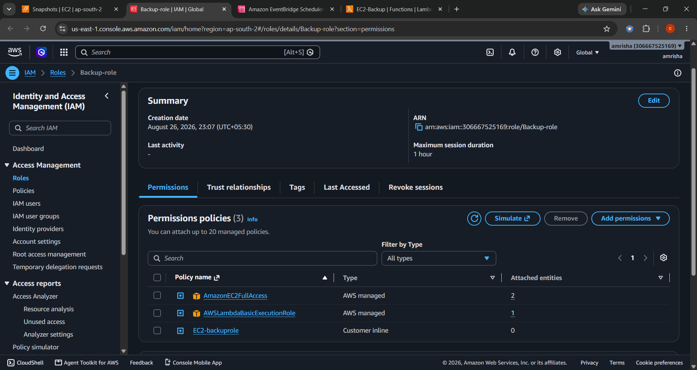

# AWS Automated EC2 Backup Solution

Automating Amazon EBS snapshots using AWS Lambda and Amazon EventBridge.

This project demonstrates how I automated the backup process of an Amazon EC2 instance by creating EBS snapshots using AWS Lambda. The Lambda function is triggered automatically using Amazon EventBridge, ensuring regular backups without manual intervention.

## Architecture

## AWS Services & Tools Used

- Amazon EC2
- Amazon EBS
- AWS Lambda
- Amazon EventBridge
- AWS IAM
- Python (Boto3)
- Git
- GitHub

## What I Did

1. Launched an Amazon EC2 instance.
2. Identified the attached EBS volume.
3. Created an IAM role for Lambda permissions.
4. Developed a Lambda function using Python and Boto3.
5. Configured the Lambda function to create EBS snapshots.
6. Tested snapshot creation manually.
7. Created an EventBridge scheduled rule.
8. Automated the backup process.
9. Verified snapshot creation in AWS.
10. Documented the setup with screenshots and an architecture diagram.

## Lambda Function

I used the following Python code to automate EBS snapshot creation:
 
import boto3
from datetime import datetime

ec2 = boto3.client('ec2')

def lambda_handler(event, context):

    volume_id = 'vol-0937230e2f44c1bc6'

    response = ec2.create_snapshot(
        VolumeId=volume_id,
        Description=f'Automated backup {datetime.now()}'
    )

    return {
        'statusCode': 200,
        'snapshot_id': response['SnapshotId']
    }
 

## Screenshots

 ### IAM Role

### Lambda Function

### EventBridge Rule

### EBS Snapshot

## What I Learned

- Creating and managing EBS snapshots
- AWS Lambda fundamentals
- Event-driven automation using EventBridge
- IAM roles and permissions
- Python automation with Boto3
- AWS backup and recovery concepts
- Using Git and GitHub for version control

## Cleanup

The EC2 instance, Lambda function, EventBridge rule, and EBS snapshots should be deleted after testing to avoid unnecessary AWS charges.
